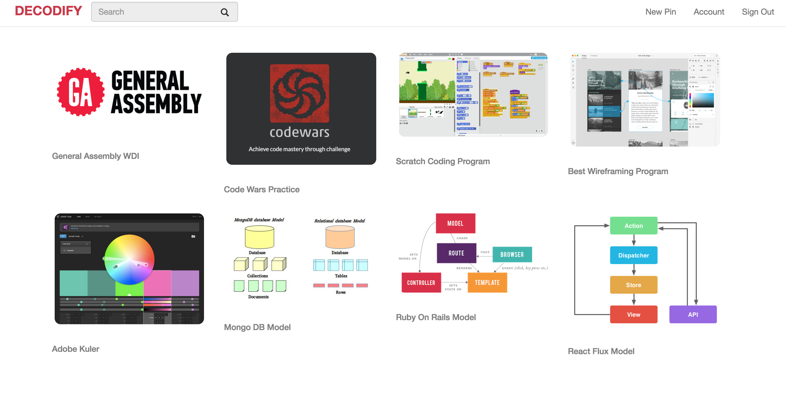
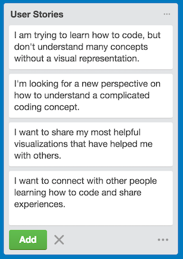
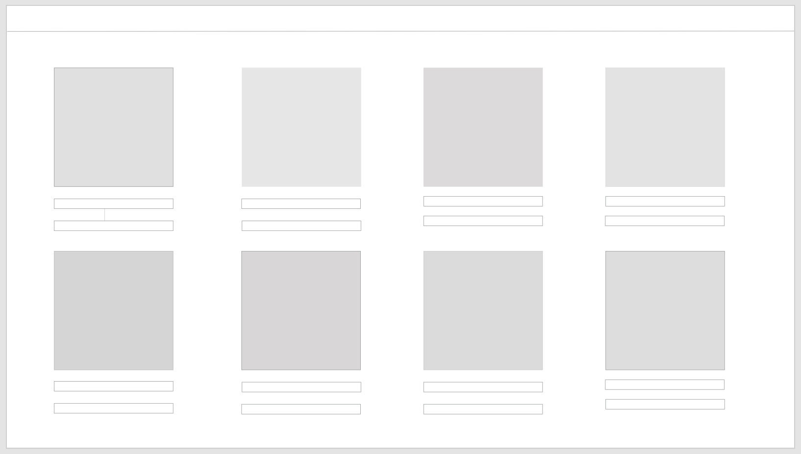
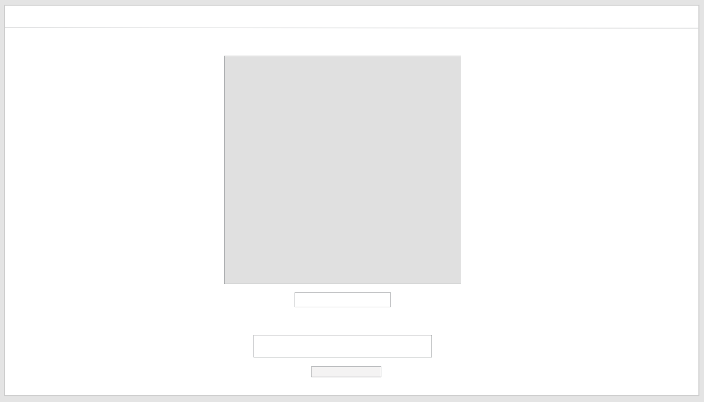

---

-

# DECODIFY was created for people learning to code who are are visual learners.
 
## Objective:

<i>DECODIFY</i> is a community for people learning to code to find visual representations of complicated coding concepts. Users may 'Pin' images and descriptions that have helped them overcome a coding learning obstacle.

## Development:

<i>DECODIFY</i> is built with Ruby & Rails + HTML5, CCS3 & Bootstrap.

## User stories:

## Wireframes:

## Dream features:
- Masonry layout
- Modal for images
- Trending topics

Trello: https://trello.com/b/KImn7tnj/decodify
